# Overview

This repo contains all the, notebooks, and final package I wrote for the Astros technical evalution. The evaluation asked to take raw (x,y,z) coordinates of different joints, and create a metric that summarizes a pitcher's delivery. I ultimately chose a kmeans clustering algorithm to cluster based on the location of the shoulder, elbow and wrist at various points along the pitcher's arm path. 

<table>
  <tr>
    <td> 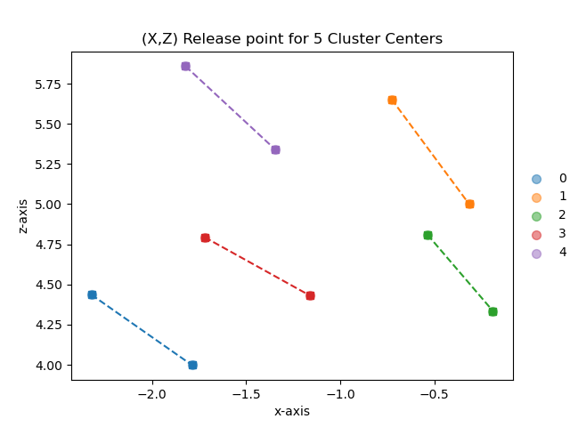</td>
    <td>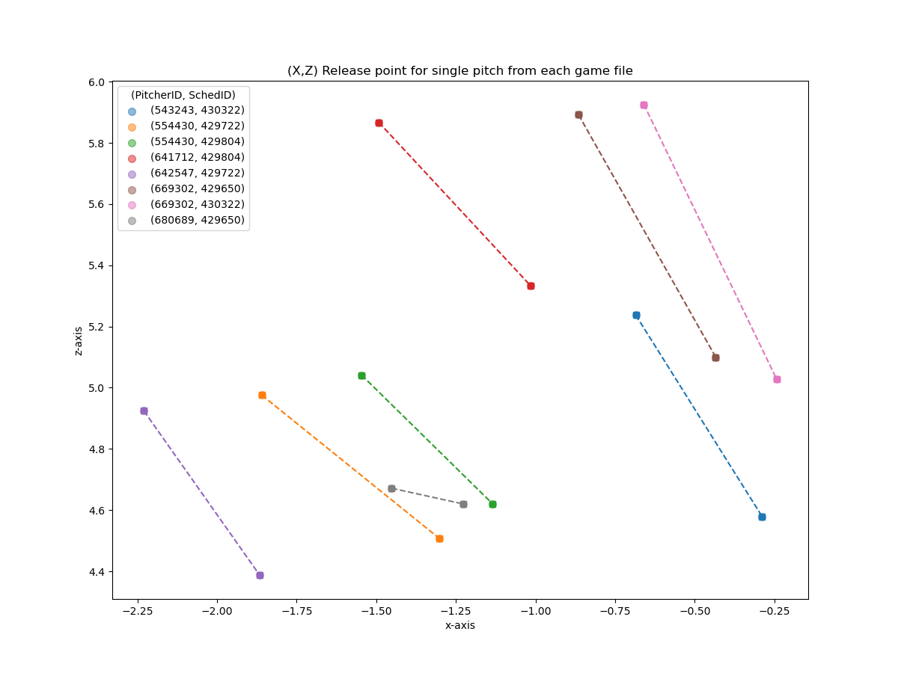</td>
   </tr> 
</table>

Above are the wris and elbow (x,z) locations at release from our generated cluster centers, as well as the location for a single pitch in each provided file to give an example of the release point of each pitcher in the sample data. The cluster centers can be used to demonstrate what the average release point looks like for each cluster. A more thorough write up on model selection is below, however, for the final model I selected 5 clusters based on the data set so that it can be the most useful for classifications of arm paths.

# EDA

## 3D pitch path

I began my analysis by looking at the provided data and plotting it in space. I isolated it initially to just the shoulder, elbow, and wrist observations to visualize a pitcher's arm path. In the eda notbook, there is an interactive 3D plot so to make exploring the data a little easier, but below is a screen grab of the plot.
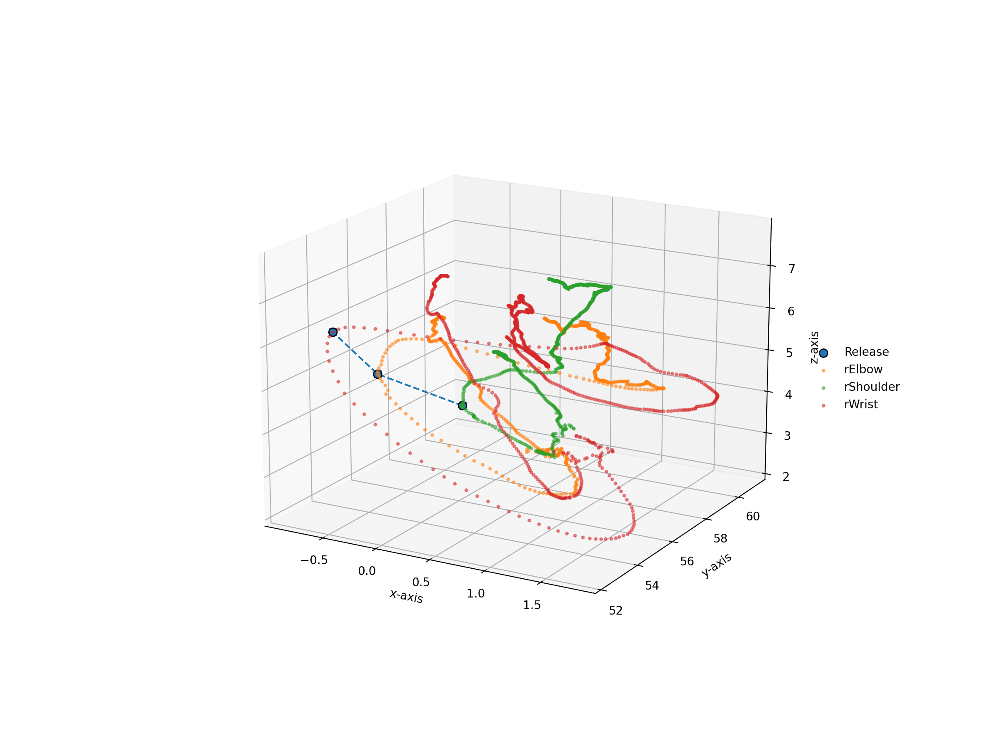

## Leg Lift Analysis

One of the goals of working with this data was to isolate when the pitcher begins to raise their leg in their wind up so that we can filter the data to the subset of interest. We have the tracking coordinates for different joints in the leg so we can see how it moves in time, but determining when the leg lift starts proposed an interesting challenge. My approach to this was to monitor the z coordinate of the knee and to find a window of consecutive observations where the z value has been monotonically increasing, e.g. the pitcher is raising their knee. Below are some graphs for a specific pitcher showing the leg lift start at different window values.
<table>
  <tr>
    <td> 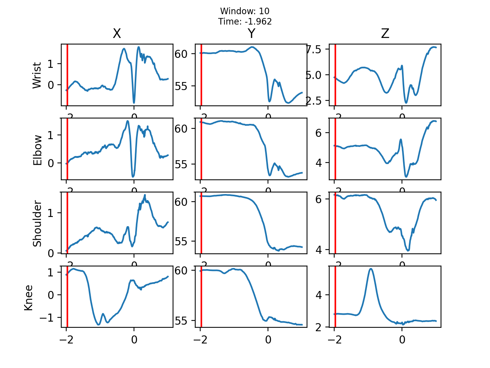</td>
    <td>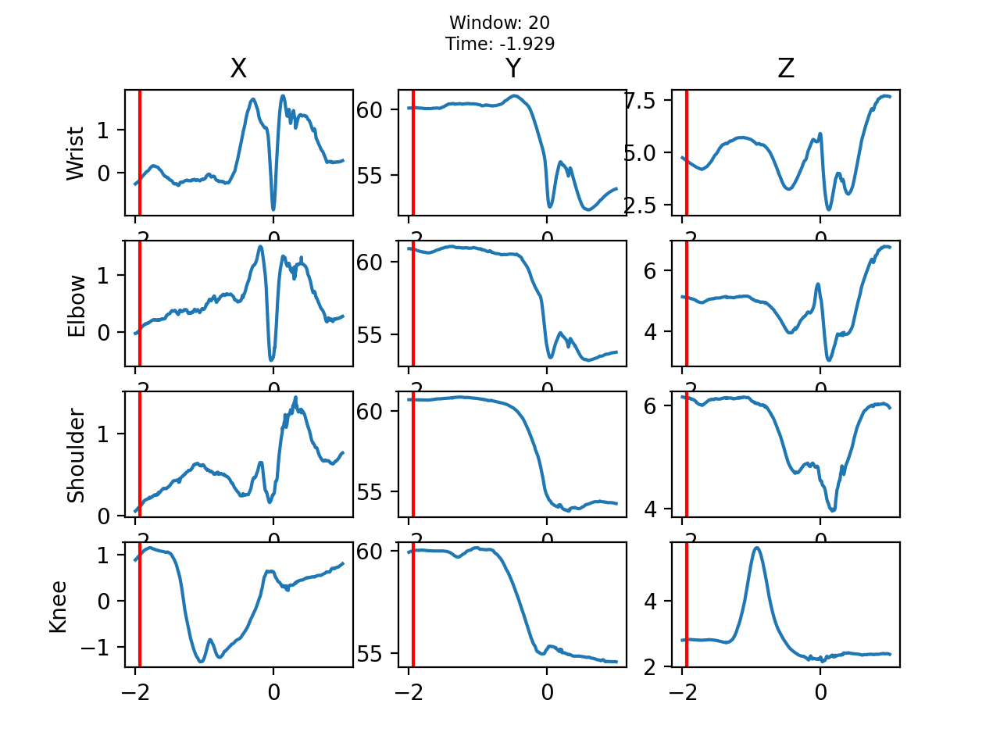</td>
   </tr> 
   <tr>
      <td>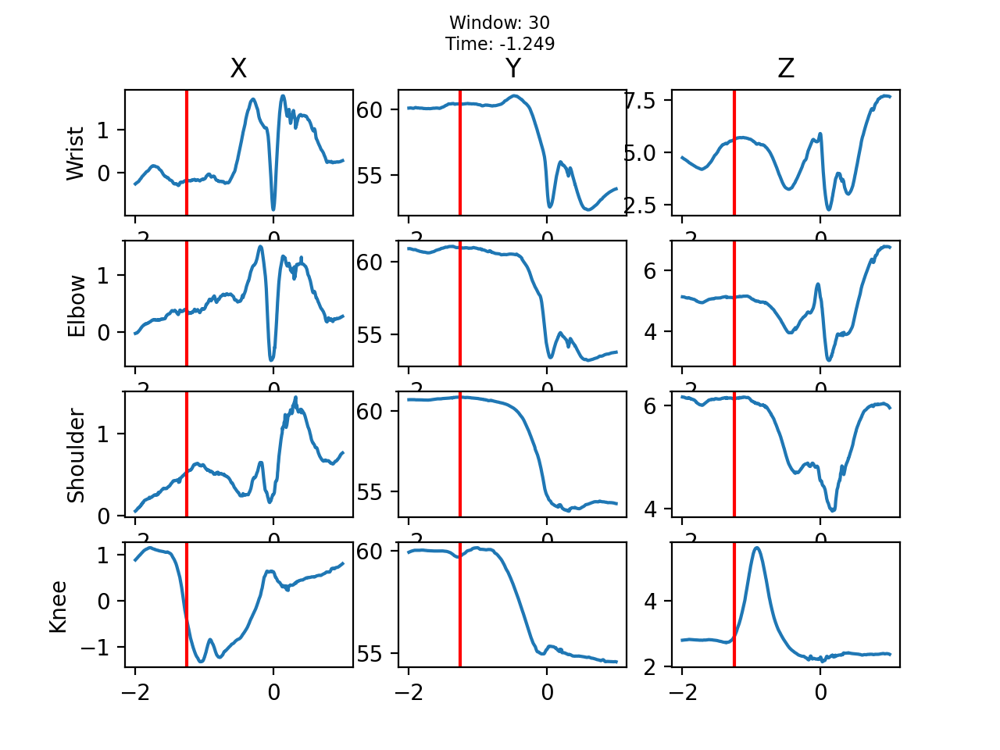</td>
      <td>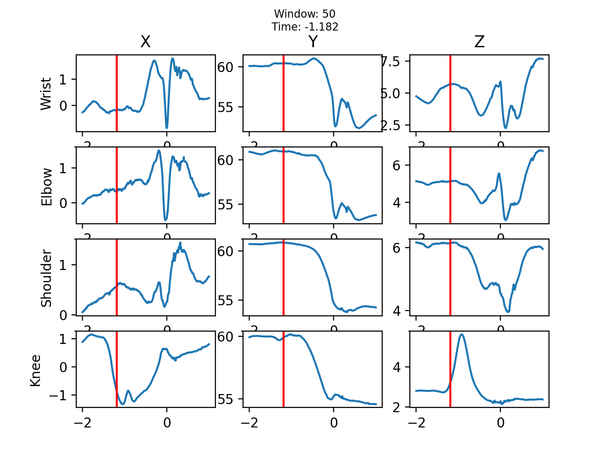
  </td>
  </tr>
</table>
If we are looking specifically at the z value of the knee, we see that windows of 10 and 20 observations do not filter out much. At 30 observations, we can see the knee begin to move upwards, and at 50 we see that line just shifted right to later in time. While this is a fairly rudimentary approach, it did allow me to quickly begin working with the data of interest. The implementation of this can be see in `pitch_path.utils.preprocessing.get_leg_lift_time()`.  

# Data Processing

For data processing, my goal was to filter to make the data easier to work with and filter it down to the useful subset for each pitch. To do this, I first started out by flattening the data for each pitch. The provided dataset had a row of x, y, z values for each joint for each pitch. I transformed this so we had a wide dataframe where each row was a singular observation where there were x, y, z columns for each joint.  

The next step was to filter each pitch in the dataframe to only be between leg lift to release so we could build features on the dataset of interest. I used the above leg lift analysis to designate a row for each pitch as the start of the leg lift by adding a new column called `start` and setting it to 1. I then added another column called `release` indicating the row where the timestamp was closest to 0. We can then drop all rows before `start` and after `release` for each pitch. Additionally, I added columns to designate 25, 50, and 75 percent of the way through the pitch by timestamp so that we could grab joint locations at specific intervals. These dataframes were saved off in the `data/output/processed` directory.

# Feature Generation

For feature generation, my goal was to keep it simple and to generate features based on the joint locations at different points along a pitchers delivery. As stated above, I set indicator variables for the start and release timestamps, as well as the 25, 50, and 75 percent of the way through. I used the timestamps to get the locations for joints of interest (shoulder, elbow, wrist) and set them as columns for our feature row. I also added columns to get the distance to the previous obsvervation for each joint location, so that we could get the total distance traveled for a joint, as well as the average velocity at various points along the path. I calculated the features so that there was one row per pitch, which was then saved off at the pitcher-game level in the `data/output/pitcher_features` directory. I then combined each of those to create a training data set saved at `data/output/training`. Below is a description of the final feaure set I used for modeling. 

|                            |   count |       mean |      std |      min |      25% |      50% |      75% |      max |
|:---------------------------|--------:|-----------:|---------:|---------:|---------:|---------:|---------:|---------:|
| distance_traveled_wrist    |     767 | 13.1003    | 1.12593  | 10.2887  | 12.3043  | 13.065   | 13.9676  | 16.2422  |
| wrist_x_start              |     767 | -0.0696623 | 0.619497 | -1.2462  | -0.45955 | -0.0536  |  0.42345 |  0.943   |
| wrist_y_start              |     767 | 60.3153    | 0.186453 | 59.702   | 60.1935  | 60.3209  | 60.4841  | 60.7099  |
| wrist_z_start              |     767 |  5.3773    | 0.550649 |  4.535   |  4.94215 |  5.4109  |  5.6065  |  6.7424  |
| wrist_x_time_25            |     767 | -0.163938  | 0.595499 | -1.5258  | -0.6188  | -0.0877  |  0.1944  |  0.853   |
| wrist_y_time_25            |     767 | 60.2944    | 0.271265 | 59.6819  | 60.0613  | 60.2902  | 60.4525  | 60.943   |
| wrist_z_time_25            |     767 |  5.41635   | 0.446025 |  3.1974  |  5.0973  |  5.5441  |  5.77755 |  6.1205  |
| wrist_x_time_5             |     767 |  0.112397  | 0.613694 | -1.3745  | -0.0829  |  0.2011  |  0.56025 |  1.6534  |
| wrist_y_time_5             |     767 | 60.2601    | 0.255206 | 59.6829  | 60.0733  | 60.2407  | 60.4234  | 60.9647  |
| wrist_z_time_5             |     767 |  4.29101   | 0.706627 |  2.3288  |  3.6881  |  4.3448  |  4.9481  |  5.597   |
| wrist_x_time_75            |     767 |  1.58004   | 0.615737 | -1.086   |  1.18105 |  1.6847  |  2.05825 |  2.6206  |
| wrist_y_time_75            |     767 | 59.8755    | 0.457215 | 58.5569  | 59.4637  | 59.8626  | 60.2582  | 60.7876  |
| wrist_z_time_75            |     767 |  3.86012   | 0.701118 |  2.4205  |  3.3478  |  3.908   |  4.3242  |  5.5349  |
| wrist_x_release            |     767 | -1.40567   | 0.658844 | -2.7051  | -1.9036  | -1.5518  | -0.7631  | -0.1497  |
| wrist_y_release            |     767 | 54.3525    | 0.737192 | 52.8618  | 53.7523  | 54.2968  | 54.9648  | 56.2054  |
| wrist_z_release            |     767 |  5.10992   | 0.562367 |  3.7681  |  4.66515 |  5.0172  |  5.65715 |  6.1824  |
| distance_traveled_elbow    |     767 | 10.409     | 0.970062 |  8.26352 |  9.66858 | 10.4665  | 11.1599  | 12.6259  |
| elbow_x_start              |     767 |  0.454518  | 0.580344 | -1.0594  |  0.0359  |  0.433   |  0.85245 |  1.5521  |
| elbow_y_start              |     767 | 60.8712    | 0.198958 | 60.2458  | 60.7463  | 60.8307  | 61.0433  | 61.2895  |
| elbow_z_start              |     767 |  5.16302   | 0.471786 |  4.5506  |  4.9345  |  5.0836  |  5.2256  |  6.5052  |
| elbow_x_time_25            |     767 |  0.399327  | 0.548808 | -0.8948  | -0.0124  |  0.4834  |  0.7437  |  1.5716  |
| elbow_y_time_25            |     767 | 60.7596    | 0.269015 | 60.1454  | 60.5488  | 60.7529  | 60.9318  | 61.294   |
| elbow_z_time_25            |     767 |  5.03919   | 0.27403  |  3.9111  |  4.8755  |  5.0298  |  5.24945 |  5.5939  |
| elbow_x_time_5             |     767 |  0.752456  | 0.589795 | -0.6132  |  0.3708  |  0.7918  |  1.22805 |  1.8165  |
| elbow_y_time_5             |     767 | 60.3779    | 0.218032 | 59.6738  | 60.2433  | 60.4195  | 60.5353  | 60.8609  |
| elbow_z_time_5             |     767 |  4.44188   | 0.382405 |  3.1254  |  4.1659  |  4.403   |  4.8272  |  5.186   |
| elbow_x_time_75            |     767 |  1.24584   | 0.457725 | -0.1872  |  0.7913  |  1.2825  |  1.62615 |  2.0631  |
| elbow_y_time_75            |     767 | 59.3579    | 0.383896 | 58.0638  | 59.1437  | 59.2752  | 59.6084  | 60.2273  |
| elbow_z_time_75            |     767 |  4.27062   | 0.468964 |  3.2167  |  3.97495 |  4.2702  |  4.58225 |  5.239   |
| elbow_x_release            |     767 | -0.926334  | 0.583898 | -2.1442  | -1.4165  | -1.007   | -0.33805 |  0.1706  |
| elbow_y_release            |     767 | 54.5241    | 0.506942 | 53.5525  | 54.148   | 54.4895  | 54.8466  | 55.9196  |
| elbow_z_release            |     767 |  4.63069   | 0.460032 |  3.5819  |  4.24435 |  4.581   |  5.01915 |  5.4968  |
| distance_traveled_shoulder |     767 |  7.13107   | 0.83571  |  4.80595 |  6.58249 |  7.44043 |  7.73654 |  8.96538 |
| shoulder_x_start           |     767 |  0.611184  | 0.629763 | -0.7275  |  0.1243  |  0.6166  |  0.86735 |  1.7421  |
| shoulder_y_start           |     767 | 60.5391    | 0.202801 | 59.9593  | 60.4614  | 60.5241  | 60.6677  | 60.9354  |
| shoulder_z_start           |     767 |  5.92607   | 0.226488 |  5.4344  |  5.75595 |  5.9077  |  6.14175 |  6.2283  |
| shoulder_x_time_25         |     767 |  0.681315  | 0.590724 | -0.593   |  0.2489  |  0.7241  |  0.99935 |  1.7173  |
| shoulder_y_time_25         |     767 | 60.424     | 0.217613 | 59.879   | 60.2899  | 60.4459  | 60.5965  | 60.8076  |
| shoulder_z_time_25         |     767 |  5.84683   | 0.271027 |  4.734   |  5.6113  |  5.9013  |  6.04995 |  6.2477  |
| shoulder_x_time_5          |     767 |  0.602892  | 0.522122 | -0.593   |  0.19095 |  0.6066  |  1.11835 |  1.4581  |
| shoulder_y_time_5          |     767 | 60.0842    | 0.219707 | 59.1892  | 59.9564  | 60.0995  | 60.2136  | 60.5645  |
| shoulder_z_time_5          |     767 |  5.36065   | 0.405612 |  4.0557  |  5.0109  |  5.3553  |  5.7549  |  6.0231  |
| shoulder_x_time_75         |     767 |  0.519898  | 0.455945 | -0.4444  |  0.005   |  0.535   |  0.9235  |  1.303   |
| shoulder_y_time_75         |     767 | 58.8801    | 0.349537 | 57.5174  | 58.6866  | 58.9054  | 59.1072  | 59.9871  |
| shoulder_z_time_75         |     767 |  4.65455   | 0.318087 |  3.983   |  4.4986  |  4.6808  |  4.85795 |  5.3633  |
| shoulder_x_release         |     767 | -0.109386  | 0.535419 | -1.2679  | -0.56845 | -0.0569  |  0.3589  |  0.8989  |
| shoulder_y_release         |     767 | 54.9373    | 0.458868 | 54.1976  | 54.5743  | 54.8507  | 55.1752  | 56.1459  |
| shoulder_z_release         |     767 |  4.28685   | 0.406745 |  3.492   |  3.9237  |  4.3284  |  4.5178  |  5.1194  |

# Modeling

The goal of this project was to come up a metric to summarize a pitcher's arm path during his delivery. My approach was to use the features listed above and to attempt to cluster them to see if we could find some common arm paths. By grouping pitcher arm paths together, we can then look at cluster level statistics, or look and see if there are any trends that affect one specific cluster more than another. One thing that comes to mind is monitoring pitching injuries and seeing if the arm path is a contributing factor. Other uses could be pitch shape effectiveness by arm slot and see what in cluster differences there are for pitchers. It could also be used to evaluate hitters by arm slot to see if there are certain arm slots they perform better or worse against.  

For my model, I used a simple k-means clustering algorithm and evaluated different values of K. I used a traditional elbow method to choose K, as well as utilizing silhouette plots. Below is the output of my experimentation with different features outputing the maximum silhouette scores for different values of K. 

As you can see, the highest silhouette score was using our feature subset of only the x, z values of our joint columns with `K=7`. Diving into those specific parameters, we get the following silhouette and elbow plots.

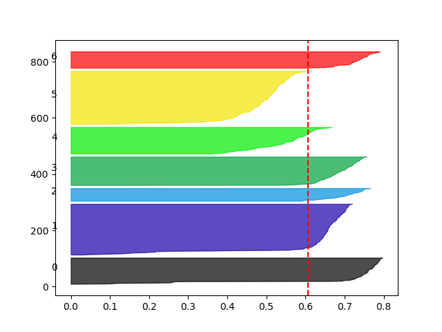
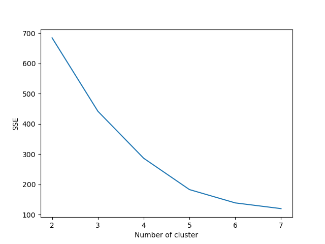

As you can see in the silhouette plot, there is a cluster that is not suffienctly above the average silhouette score. After some more analysis, I settled on using the feature set `wrist_elbow_release_xz` which consisted of the columns `['wrist_x_release', 'wrist_z_release', 'elbow_x_release', 'elbow_z_release']` -- so we are only clustering on the x and z values of the elbow, and wrist at release. Using 5 clusters, this was the silhouette and elbow plots.

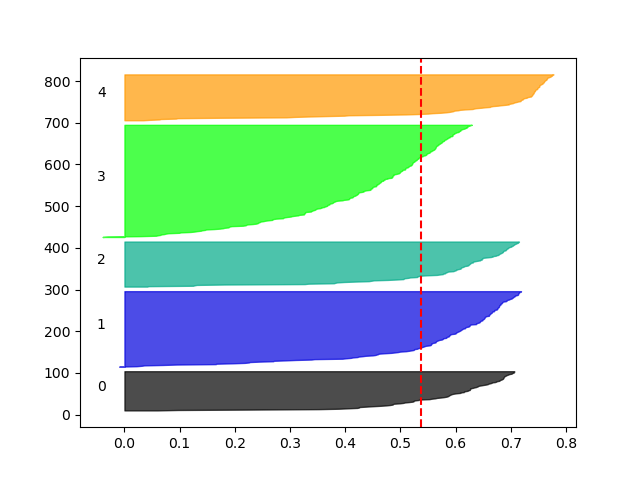

  

After feature selection and evaluating the elbow and silhouette plots, I decided to plot the cluster centers (the (x, z) release points for wrist and elbow) for various different cluster numbers, and compared them the the single pitch plot shown at the start. Below are all of the centroids from 3 - 8 clusters.

  

<table>
  <tr>
    <td> 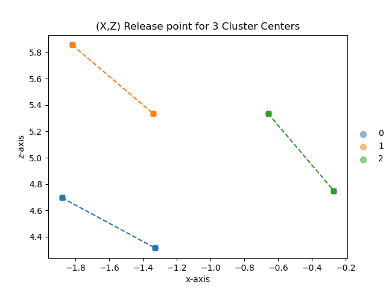</td>
    <td>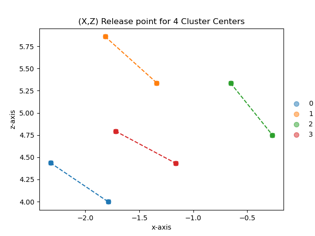</td>
    <td></td>
   </tr> 
   <tr>
    <td>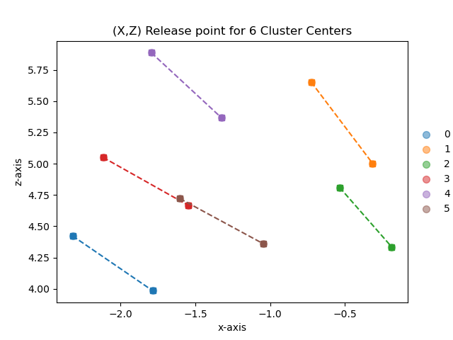</td>
    <td>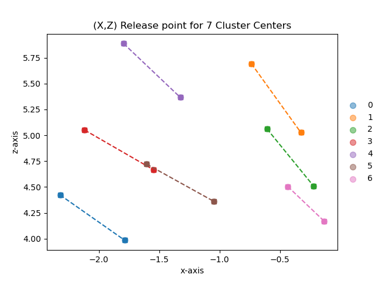</td>
    <td>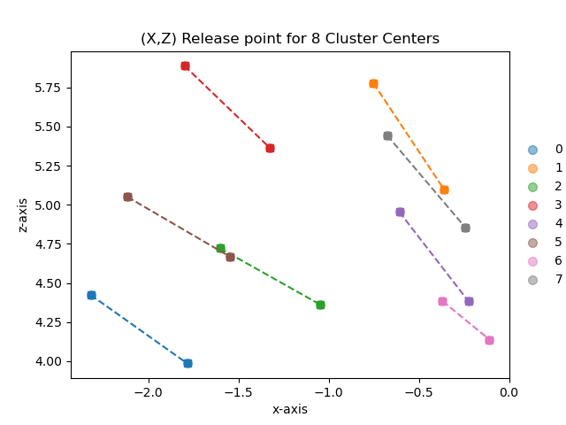</td>

  </td>
  </tr>
</table>

  

We can use silhouette and elbow plots to evaluate our cluster quality, but that doesn't necessarily mean these clusters will be useful in practice. We only had 6 pitchers in our dataset, and in some instances 6 clusters was the best value of . However, if we had a different cluster for each pitcher at scale, that doesn't really help us with pitcher evaluations and how pitching arm paths can relate to different metrics. Keeping this in mind, I settled with using 5 clusters. Below, I have plotted those cluster centers next to the single pitch release point in each game so that we can compare our proposed clusters to actual values. In the plots, its easy to see how the actual arm paths relate and fall into our cluster centers. 

  

<table>
  <tr>
    <td> </td>
    <td></td>
   </tr> 
</table>

Using 5 clusters, we get the following assignments for each pitch in our sample data. We see that most pitchers fall into mostly 1 cluster, with the excpetion of pitcher `680689`.

|    |   pitcher_id |   cluster_label |   size |
|---:|-------------:|----------------:|-------:|
|  0 |       543243 |               2 |    101 |
|  1 |       554430 |               1 |    181 |
|  2 |       554430 |               2 |      1 |
|  3 |       641712 |               3 |    105 |
|  4 |       642547 |               0 |     94 |
|  5 |       669302 |               2 |    189 |
|  6 |       669302 |               3 |      1 |
|  7 |       680689 |               1 |     76 |
|  8 |       680689 |               3 |     19 |

# Next Steps

As this is a pretty large project, and I wanted to get something turned in to you all in time, there were several things that I did not get a chance to review. Here are a list of future steps for this project:

* adding automation scripts that can automate ingestion, preprocessing, feature generation, and inference to classify new pitchers
* more sophisticated leg lift algorithm to better isolate the pitch start
* more sophisticated features like angle between wrist, elbow, shoulder, and parallel
* researching signal processing and its applications for feature improvements
* conducting PCA before clustering
* better implementation of feature generation with vetorized functions -- right now these are slow and not optimized for large datasets. 
* additional modeling techniques and more sophisticated model selection
* evaluation of more pitchers, including left handed pitchers as this dataset only contained righties

# Repo

### Usage

This repo has been set up as a python package called `pitch_path` that can be imported to do data preprocessing and feature generation. The final selected model has also been included and can be loaded in as a pickle file so that new pitcher files can be classified in one of the four clusters.

To install, create a new python virtual environment and run

`pip install .`  

from the root directory.

### File Structure

This repo contains files related to both EDA, feature development, and package development. 

* data
    * input -- directory containing all raw data files
    * output
        * processed -- directory containing all the provided files that have been preprocessed and ready to have features built
        * pitcher_features -- directory containing features for each pitcher file provided. each file should have 1 feature row per pitch
        * training -- directory containing a single file with all pitcher features. this was the file used for clustering.
* nbs -- repo with all jupyter notebooks using the `pitch_path` package for EDA, data processing, feature generation and modeling. this is where the majority of my work occured.
* pitch_patch
    * files -- directory containing important files like the `joint_ids.csv` file
    * model -- directory containing the kmeans model and data scaler for future inference
    * processing -- directory containing python class to handle processing an input data file and create feature dataframes
    * scripts -- directory to place future scripts for automation
    * utils -- directory containing utilities for data preprocessing, feature generation, etc.
